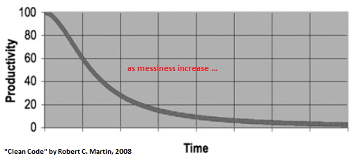

### Code quality

---

Agenda:
* We will look at a script and see some drawbacks of the "script style"
* We try to explain the benefits of many small functions rather than few big functions

+++
* We will see how to
  * use git (some experience is assumed)
  * write tests
  * setup automatic testing
  * make a setup script that can be used to test and install the project

---

### Why Code quality is important!

+++

3 & 6 June, 1980  
__[NORAD and Nuclear Attack Warnings](https://en.wikipedia.org/wiki/North_American_Aerospace_Defense_Command)__

<small>"... On 3 June 1980, and again on 6 June 1980, a computer communications device failure caused warning messages to sporadically flash in U.S. Air Force command posts around the world that a nuclear attack was taking place. ..."</small>

___

26 September, 1983  
__[The man who saved the world by doing nothing](https://www.wired.com/2007/09/dayintech-0926-2/)__

<small>"... One of the satellites signaled Moscow that the United States had launched five ballistic missiles at Russia ..."</small>

+++

__Productivity vs. Time__
  - being __slow down__ by __messy code__



+++

You are not an __island__ and,  
... your __memory__ will __fail you__!


---

### What's code quality

+++

It's about ...

- doing __the right thing__, __right__
  - well-tested
  - bug-free code

- writing __clear__ & __simple__ code
  - easy to __understand__
  - easy to __maintain__
  - __self-explaining__

---

### Fundamentals & Best Practice

<small>_... get your machine in order and up to date with the tools you need to do your work._</small>

+++

#### Runtime Environment

- Which __version of python__ is used?
- Which __version of the packages__ are required?

If using __vanilla python__ look into __Virtualenv__, and  
if using __conda__ look into __environment__.

+++

An example of a conda __environment__ <small>(environment.yml)</small> ...

```
name: myEnvironment

dependencies:
- python=3.6.2
- pip:
  - pandas==0.21.0
  - nltk==3.2.5
  - scikit-learn==0.19.1
  - scipy==1.0.0
```

+++

#### Version Control (Git)

__Version control__ is vital when working on a task, whether __alone__ or __with other people__.

* we use git for _all_ code

+++

<small>"_Git thinks about its data more like a stream of snapshots._"</small>


+++

<small>"_Git allows to work with branches ... A branch is just an indipendent line of developmnet._"</small>


+++


#### Interactive Development Environment (IDE)

_An IDE does not make you a good programmer but_  
_can make your life easier._

- code completion
- syntax highlight
- search
- refactoring
- ...

+++

#### Coding style: [PEP-8 Standard](http://legacy.python.org/dev/peps/pep-0008/)

* __Indents__ - 4 spaces for each indentation (no TAB)
* __Maximum line length__ - 80 characters
* __Blank lines__ - 2 between imports/ classes/ functions; 1 between methods within a class
* __Import statements__ - 1 per line
* __Class names__ - capital for the first letter (and then camel case)
* __Method names__ - all lowercase and underscore to separate words  

+++

#### Coding style: Clean Code

- __Use meaningful names__ for your variables, functions, arguments, classes ...
- __Explain yourself in code__ use the code to express your intentions
- __Use comments__ to compensate the inability to express your intention with the code (<small> comments do not make up for bad code!</small>)  

---

### Script style development

In Statoil we often see there are scripts written that have no functions

span 200-2000 lines of code.

+++

Some examples recently include
* 764 LOC else block
* 700 LOC function called `run()`
* 500 LOC function called `named_plot` taking 14 parameters
* 400 LOC script, no functions

+++


+++

* recommend: at most 30 LOC / function
  * but more is ok if it does _one_ thing!
* fewer LOC if complex control flow
* maximum nesting: 4 levels

+++

```python
# Ugly! Workaround to use multithreading and speed-up plotting
# TODO: create plotting class
def plot_inflow(w, p, lock=''):         # :1175
  #...
  for n, d in enumerate(well_block_prod.get_prt_dates(p)):
    if prod[0][1] == -9999:
        #...
    else:
      if percentage_opt:
        #...
        if flag_tot_contribution:
          #...
          for i, t in enumerate(oil_prod):
            if t <= 0:
              oil_prod[i] = 1.0E-9      # :1332

```

---


#### Why do we program?


---


Primary reason:
* pure pleasure

+++

We program to:

* automate work that is
  * tedious
  * slow
  * error-prone
  * boring?


---


In the process we are solving many smaller problems!

+++

These smaller problems form

> atomic building blocks of the final solution

and are often seen in other problems.

+++

> atomic building blocks

* obtaining data from wherever
* parsing and cleaning csv
* splitting dataset
* reading ECLIPSE files
* and writing them
* plotting production curves
* ...

---


#### Reusable programs

When our solution is a 500 lines long script

we ensure no reusability.

+++


* Spend 3 months writing a
* 500 LOC function taking
* more than 10 parameters,

guaranteed not used by anyone else.

+++

Those three months are much more expensive

than if you write code that many others can use.

+++

> given enough eyeballs, all bugs are shallow

More users gives better testing gives better quality

+++

> given enough eyeballs, all bugs are shallow

... is the mantra of open source

---

### Long functions

Long functions _are not well-defined_

What does `run()` do in those 700 LOC?

+++

If you cannot explain in a couple sentences exactly

* input
* output
* assumptions
* side-effects

Then
* not reusable
* should be split.


+++

#### Command-Query Separation

* A function should
  * either modify its input _(command)_
  * or return something _(query)_

+++

#### Command-Query Separation

* The best case is _immutable objects_
  * no function modifies data
  * all functions are queries

---

#### The behavior of a function

When a function is not well-defined
* it is difficult to use
* it is difficult to test
* it is difficult to debug
  * because its scope is unclear


---

### Test driven development


+++

#### Code QA

To ensure that code runs correctly, we write _unit test_.

```python
def root_mean_square(lst):
    rms = sum(map(sq, lst))/len(lst)
    return sqrt(rms)

def test_rms():
    assert root_mean_square([4,5,6,7,8]) == 6.1644
```


+++


##### Unit test

Unit tests ensure several things, amongst
* ensure _correctness_
* inform you when behavior changes
* force you into using your own program (dogfood)


---

#### Test Driven Development (TDD)


* When writing code for Statoil
  * we always employ _test driven development_
  * always

+++

##### Tests first

We write the test first!

```python
def test_rms():
    assert root_mean_square([4,5,6,7,8]) == 6.1644
```

There is no such function!  So the tests will fail!


+++


##### Test first -- then implement


```python
def root_mean_square(lst):
    # ...
```

Hopefully written correctly, tests pass!

+++


##### Test first -- then implement

Simultaneously, you got to

* use your own interface before writing it
* making it easy to understand
* reusable
* well defined

+++

EOF
